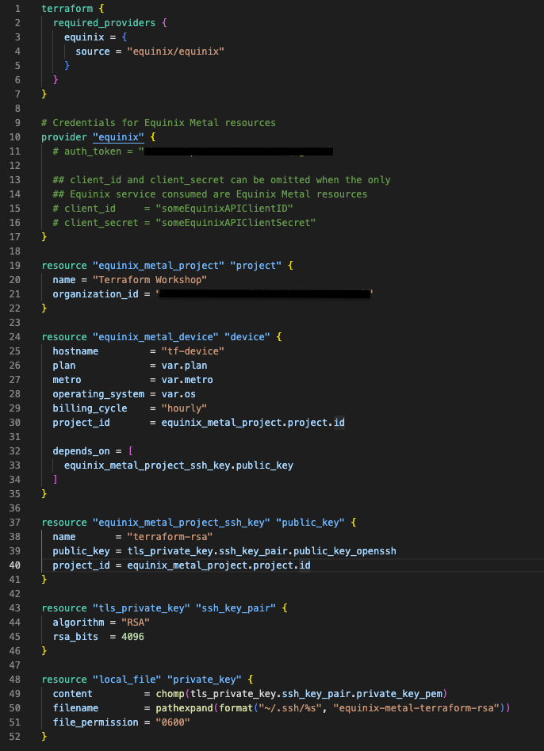

<!-- See https://squidfunk.github.io/mkdocs-material/reference/ -->
# Part 2: Provision

## Terraform Project’s Structure

The project/module structure in Terraform is quite flexible. However, we do believe that a good structure and naming rules is essential to guarantee its correct maintenance in Day-2 operations.

Code in the Terraform language is stored in plain text files with the .tf file extension. You can keep all your code in a single main.tf file with hundreds of lines of code, or split it into multiple well-named files and folders that make sense for your use case (just in case, this is the right choice). Below is an example of a simple project structure:

* main.tf Declare all resource and datasource definitions
* outputs.tf Declare all outputs in this file. Output values are similar to return values in programming languages
* variables.tf Declare all input variables in this file. Input variables let you customize aspects of Terraform modules without altering the module's own source code
* terraform.tfvars Assign/override values of the variables defined in the variables.tf file

## Steps

### 1. Provider

Each Terraform module must declare which providers it requires, so that Terraform can install and use them. Provider requirements are declared in a required_providers block. You can also specify a version constraint for compability restrictions.

Some providers requires some settings (credentials, a default project or region, ...) before Terraform can use them.

Create a `main.tf` file to configure the provider. Insert the code below and keep the `auth_token` as is, we will update it later in this workshop

```hcl
terraform {
  required_providers {
    equinix = {
      source = "equinix/equinix"
    }
  }
}

# Credentials for Equinix Metal resources
provider "equinix" {
  auth_token = "someEquinixMetalToken"

  ## client_id and client_secret can be omitted when the only
  ## Equinix service consumed are Equinix Metal resources
  # client_id     = "someEquinixAPIClientID"
  # client_secret = "someEquinixAPIClientSecret"
}
```

### 2. Resources

Define a new metal project a set your organization ID

```hcl
resource "equinix_metal_project" "project" {
  name = "Terraform Workshop"
  organization_id = "someEquinixMetalOrgId"
}
```

Add a new Equinix Metal device (baremetal server) with an implicit dependency in `project_id`

```hcl
resource "equinix_metal_device" "device" {
  hostname         = "tf-device"
  plan             = "c3.small.x86"
  metro            = "sv"
  operating_system = "ubuntu_20_04"
  billing_cycle    = "hourly"
  project_id       = equinix_metal_project.project.id
}
```

Add a new Equinix Metal project SSH key. Insert the code below and keep the ssh_key as is, we will update it later in this workshop

```hcl
resource "equinix_metal_project_ssh_key" "public_key" {
  name       = "terraform-rsa"
  public_key = "someRsaSshKeyContent"
  project_id = equinix_metal_project.project.id
}
```

Use terraform `TLS` provider to create an OpenSSH formatted private key

```hcl
resource "tls_private_key" "ssh_key_pair" {
  algorithm = "RSA"
  rsa_bits  = 4096
}
```

> **_Pro Tip:_** unless you need a specific provider version, none of the official [hashicorp providers](https://registry.terraform.io/namespaces/hashicorp) need to be added to the `terraform.required_providers` block

Use terraform `local` provider to store the private key

```hcl
resource "local_file" "private_key" {
  content         = chomp(tls_private_key.ssh_key_pair.private_key_pem)
  filename        = pathexpand(format("~/.ssh/%s", "equinix-metal-terraform-rsa"))
  file_permission = "0600"
}
```

Update `equinix_metal_project_ssh_key.public_key` to reference the public key

```hcl
resource "equinix_metal_project_ssh_key" "public_key" {
  ...
  public_key = chomp(tls_private_key.ssh_key_pair.public_key_openssh)
}
```

> **_Pro Tip:_** you can use `depends_on` meta-argument to declare explicit dependencies between resources
 
If you create a new device in a project, all the keys of the project's collaborators will be injected to the device. Add `depends_on` in the device resource to make sure the key is created before the device

```hcl
resource "equinix_metal_device" "device" {
  ...
  depends_on = [ equinix_metal_project_ssh_key.public_key ]
}
```

### 4. Outputs

Create an `outputs.tf` file to expose some computed attributes that you will need later

```hcl
output "project_id" {
  value = equinix_metal_project.project.id
}

output "device_id" {
  value = equinix_metal_device.device.id
}

output "device_public_ip" {
  value = equinix_metal_device.device.access_public_ipv4
} 
```

### 5. Variables

Create a `variables.tf` file and define some useful inputs

```hcl
variable "plan" {
  type        = string
  description = "device type/size"
  default     = "c3.small.x86"
}

variable "metro" {
  type        = string
  description = "Equinix metro code"
  default     = "SV"
}

variable "os" {
  type        = string
  description = "Operating system"
  default     = "ubuntu_20_04"
}
```

Update `main.tf` to start using these new variables

```hcl
resource "equinix_metal_device" "device" {
  hostname         = "tf-device"
  plan             = var.plan
  metro            = var.metro
  operating_system = var.os
  billing_cycle    = "hourly"
  project_id       = equinix_metal_project.project.id
  depends_on       = ["equinix_metal_project_ssh_key.public_key"]
}
```

### 6. Tfvars files

Default variable values can be overridden on the command line. In fact, a default value is not even required, Terraform will prompt for an input for the variables with no default value.

To set lots of variables, it is more convenient to specify their values in a variable definitions file `.tfvars`.

Create a `terraform.tfvars` file and add key/value inputs for the variables

```
plan  = "c3.medium.x86"
metro = "fr"
os    = "ubuntu_22_04"
```

> **_Pro Tip:_** you can have multiple `.tfvars` to reuse your code in different projects/locations/environments, such as `dev.tfvars`, `staging.tfvars`, `web_frontend.tfvars`, `web_backend.tfvars`, etc. You will be able to specify which one you want to use when creating the infrastructure
 
### 6. Environment variables

It is not a good practice to include your credentials directly in your template. Although there are more secure options, a good first practice is to use environment variables instead. Before using a new provider, checkout its documentation for more details on the [available authentication methods](https://registry.terraform.io/providers/equinix/equinix/latest/docs).

To configure Equinix Metal credentials, you will need to add the `METAL_AUTH_TOKEN` variable. 

```shell
export METAL_AUTH_TOKEN=someEquinixMetalToken
```

> **_Pro Tip:_** You can use metal-cli to add the required credentials without printing them on your screen
>
>In Bash:
>
>```bash
>eval $(metal env)
>```
>
>Use `--help` for other shells examples:
>
>```shell
>metal env --help
>```

Now, you can delete the `auth_token = "someEquinixMetalAPIToken"` line we kept in `main.tf` file

Just one last Tip, any variable you set on your .tf templates (`plan`, `metro` and `os` in this workshop)
can be set as a environment variable in the format `TF_VAR_name` and this will be checked last for a value. For example:

```bash
export TF_VAR_plan=`c3.medium.x86`
export TF_VAR_metro=`fr`
export TF_VAR_os=`ubuntu_22_04`
```

Check out metal-cli for some useful variables you can take advantage of in your projects

```sh
metal env --output terraform
```

### 7. Verify

At this point, your project should look like this:

```shell
tree
.
├── main.tf
├── outputs.tf
├── terraform.tfvars
└── variables.tf

1 directory, 4 files
```

And the main.tf file:



## Discussion

Before proceeding to the next part let's take a few minutes to discuss what we did. Here are some questions to start the discussion.

* Can other providers be used in the same template/project?
* Are all the Equinix platform resources available on Terraform?
