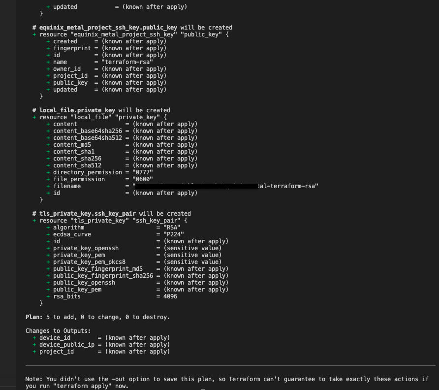
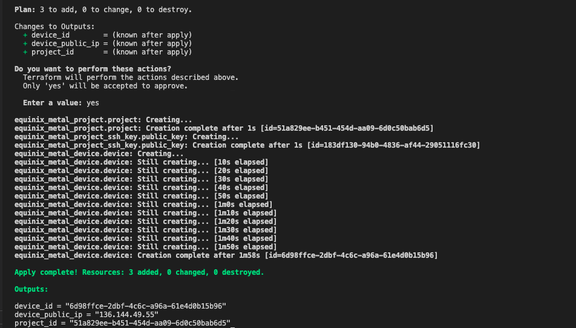

<!-- See https://squidfunk.github.io/mkdocs-material/reference/ -->
# Part 3: Application

## Steps

### 1. Terraform init

The `terraform init` command initializes a working directory containing Terraform configuration files.

```shell
terraform init
```

Expected output:

```shell
terraform init

Initializing the backend...

Initializing provider plugins...
- Finding latest version of equinix/equinix...
- Finding latest version of hashicorp/tls...
- Finding latest version of hashicorp/local...
- Installing hashicorp/local v2.4.0...
- Installed hashicorp/local v2.4.0 (signed by HashiCorp)
- Installing equinix/equinix v1.13.0...
- Installed equinix/equinix v1.13.0 (signed by a HashiCorp partner, key ID 1A65631C7288685E)
- Installing hashicorp/tls v4.0.4...
- Installed hashicorp/tls v4.0.4 (signed by HashiCorp)

Partner and community providers are signed by their developers.
If you'd like to know more about provider signing, you can read about it here:
https://www.terraform.io/docs/cli/plugins/signing.html

Terraform has created a lock file .terraform.lock.hcl to record the provider
selections it made above. Include this file in your version control repository
so that Terraform can guarantee to make the same selections by default when
you run "terraform init" in the future.

Terraform has been successfully initialized!

You may now begin working with Terraform. Try running "terraform plan" to see
any changes that are required for your infrastructure. All Terraform commands
should now work.

If you ever set or change modules or backend configuration for Terraform,
rerun this command to reinitialize your working directory. If you forget, other
commands will detect it and remind you to do so if necessary.
```

### 1. Terraform plan

The `terraform plan` command creates an execution plan, which lets you preview the changes that Terraform plans to make to your infrastructure.

```shell
terraform plan
```

Expected output:



### 2. Terraform apply

The `terraform apply` command executes the actions proposed in a Terraform plan.

```shell
terraform apply
```

Enter yes when prompted for input

Expected output:



### 3. Verify

Take the `project_id` from the terraform apply and use metal cli to check the status of the new server

```shell
export METAL_PROJECT_ID=$(terraform output --raw project_id)
metal devices get
```

Expected output:

```shell
export METAL_PROJECT_ID=$(terraform output --raw project_id)
metal devices get
+--------------------------------------+-----------+------------------+--------+----------------------+
|                  ID                  | HOSTNAME  |        OS        | STATE  |       CREATED        |
+--------------------------------------+-----------+------------------+--------+----------------------+
| 6d98ffce-2dbf-4c6c-a96a-61e4d0b15b96 | tf-device | Ubuntu 22.04 LTS | active | 2023-03-17T11:21:12Z |
+--------------------------------------+-----------+------------------+--------+----------------------+
```


SSH login into the server

```shell
ssh -i ~/.ssh/equinix-metal-terraform-rsa root@$(terraform output device_public_ip)
```

## Discussion

Before proceeding to the next part let's take a few minutes to discuss what we did. Here are some questions to start the discussion.

* How does Terraform keep track of my infrastructure changes?
* Can I scale up or replicate my device to another location without duplicating code?
